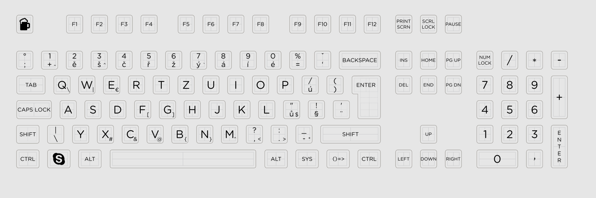

# Filco Convertible 2 Tenkeyless with custom Czech keycap set
This repo contains some information about my favorite keyboard that I bought on spring 2019.
After doing some research I found the Filco to be one of the best keyboards manufacturer in terms of build quality.
The keyboard that I finally decided to buy has the following specification:

|     |     |
| --- | --- |
| Name | Filco Convertible 2 Tenkeyless |
| Layout | ISO |
| Connection |	USB & Bluetooth |
| Number of keys |	88 |
| Switch Type |	Cherry MX Silent Red |
| Length |		356 mm |
| Depth	 |	135 mm |
| Height |		33 mm |
| Weight |		980 g |

The most interesting part of my journey to get my keyboard was the custom design of keycaps set.
I found online shop https://www.wasdkeyboards.com that has keycaps designer and customisable template so you can really create your own legends on keycaps and order them directly.

I'm Czech and I like typing on Czech keyboard so I created keycaps for the Czech layout and here is my customised template that I uploaded during the order:

Template has 105 although I ordered 88 keys keyboard.
